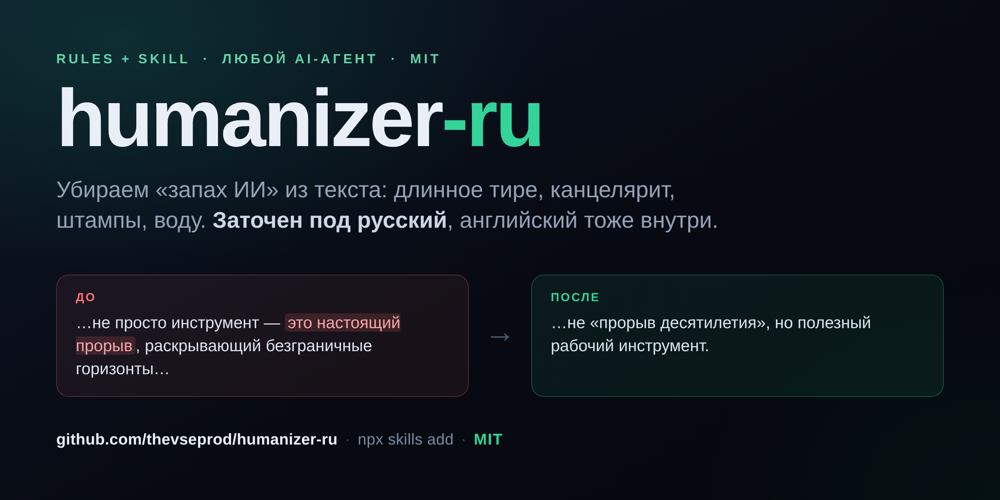
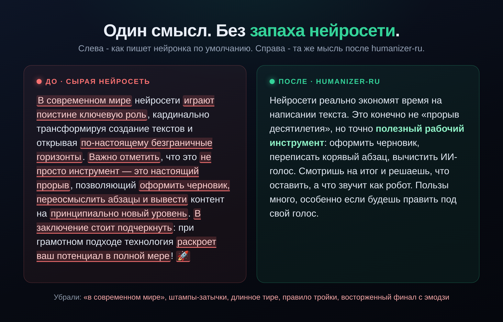

# humanizer-ru



> Делает текст нейросети живым, как будто писал человек. Заточен под русский, есть и английская версия.
> Makes AI text read like a human wrote it. Built for Russian, works for English too.

[🇷🇺 Русский](#-русский) · [🇬🇧 English](#-english)

   

<a id="русский"></a>

## 🇷🇺 Русский

Почти все «хьюманайзеры» англоязычные и не ловят то, что выдаёт русскую нейросеть:
длинное тире «—», канцелярит, маркетинговые слова-пустышки. Этот ловит. И английский
набор правил тоже внутри.

Кода нет, ставить ничего не нужно: это markdown-файл с правилами, который ты
вставляешь в любую нейросеть. Плюс есть скилл, который ставится одной командой в
Claude Code, Cursor, Codex и другие агенты.

### Почему работает

Не просто меняет слова на синонимы. Он охотится за конкретными признаками машинного
текста и переписывает их: привычку к длинному тире, штампы-затычки («важно отметить»),
буллшит-лексикон, подобострастные концовки, безличный хедж без позиции, механическое
«правило тройки», стены текста и прочее. Потом проходит вторым проходом: «что тут всё
ещё пахнет ботом?».

### Пример



Слева типичный AI-текст со всеми признаками машины, справа - та же мысль после humanizer-ru: без штампов, канцелярита и длинного тире, зато с позицией и живым ритмом.

### Быстрый старт

**Установить одной командой в любой AI-агент** (Claude Code, Cursor, Codex, Windsurf и другие) - через кросс-агентный установщик [skills](https://github.com/vercel-labs/skills):

```
npx skills add thevseprod/humanizer-ru
```

Во все агенты сразу: `npx skills add thevseprod/humanizer-ru --agent '*'`. Обновить потом: `npx skills update humanizer-ru`.

**Claude Code, как плагин:**

```
/plugin marketplace add thevseprod/humanizer-ru
/plugin install humanizer-ru@humanizer-ru
```

**Без установки, любая нейросеть (ChatGPT / Claude / Gemini / …):**

- **Отдать файл агенту** - дай [`humanizer.ru.md`](humanizer.ru.md) своему AI (Cursor, кастомный GPT и т.п.), он сам прочитает правила.
- **Скопировать в чат** - открой [`humanizer.ru.md`](humanizer.ru.md) и вставь часть от `ЗАДАЧА` до конца первым сообщением.

Потом кинь текст, который надо оживить. Готово.

**Калибровка под себя (по желанию):** дай 1-2 примера своего текста, и модель
подстроится под твою манеру. Твои примеры остаются у тебя.

### Что внутри

| Файл | Что это |
|---|---|
| [`SKILL.md`](SKILL.md) | Скилл для Claude Code и других агентов |
| [`humanizer.ru.md`](humanizer.ru.md) | Правила для **русского** текста |
| [`humanizer.en.md`](humanizer.en.md) | Правила для **английского** текста |
| `LICENSE` | MIT |

### Автор

Пишу и показываю про VSЁ о нейросетях, ИИ-агентах и вайбкодинге – для облегчения
жизни и заработка:

- 📢 Telegram: [@buyonhigh](https://t.me/buyonhigh)
- ▶️ YouTube: [@thevseproduction](https://www.youtube.com/@thevseproduction)

---

<a id="english"></a>

## 🇬🇧 English

Most "humanize AI" tools are English-only and miss the tells that give away a
Russian-language LLM (the long em dash «—», officialese, marketing buzzwords). This
one catches them, and ships an English rule set too.

No code, nothing to install: it's a markdown instruction file you paste into any LLM.
There's also a skill that installs into Claude Code, Cursor, Codex and other agents
with one command.

### Why it works

It doesn't just swap synonyms. It hunts the specific patterns that mark machine
writing and rewrites them: the em-dash habit, stock filler ("it's worth noting"),
buzzword soup, servile closers, opinion-free hedging, the mechanical rule of three,
walls of text, and more. Then it runs a second "what still smells like an AI?" pass.

### Example

**Before:** In today's fast-paced world, AI is a game-changer that unlocks unprecedented potential — it doesn't just automate tasks, it transforms everything.

**After:** AI already changed how a lot of work gets done. Not a "game-changer", just a tool that pays off once you learn where it fits.

What got cut: "in today's fast-paced world", "game-changer", "unlocks unprecedented potential", the "it doesn't just X, it Y" cadence, the em dash. What got added: a stance and a normal rhythm.

### Quick start

**Install into any AI agent with one command** (Claude Code, Cursor, Codex, Windsurf and more) - via the cross-agent [skills](https://github.com/vercel-labs/skills) installer:

```
npx skills add thevseprod/humanizer-ru
```

Into every agent at once: `npx skills add thevseprod/humanizer-ru --agent '*'`. Update later: `npx skills update humanizer-ru`.

**Claude Code, as a plugin:**

```
/plugin marketplace add thevseprod/humanizer-ru
/plugin install humanizer-ru@humanizer-ru
```

**No install, any LLM (ChatGPT / Claude / Gemini / …):**

- **Hand the file to your agent** - give [`humanizer.en.md`](humanizer.en.md) to your AI (Cursor, a custom GPT, etc.) and it reads the rules itself.
- **Copy into the chat** - open [`humanizer.en.md`](humanizer.en.md) and paste the part from `TASK` to the end as your first message.

Then send the text you want to humanize. Done.

**Optional voice calibration:** paste one or two samples of your own writing and the
model matches your style. Your samples stay with you.

### Author

I write and show everything about neural nets, AI agents and vibe-coding, to make life
and earning easier:

- 📢 Telegram: [@buyonhigh](https://t.me/buyonhigh)
- ▶️ YouTube: [@thevseproduction](https://www.youtube.com/@thevseproduction)

---

## License

MIT, see [`LICENSE`](LICENSE). Use it, fork it, ship it.
