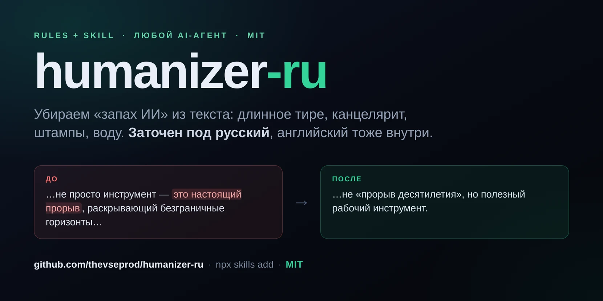
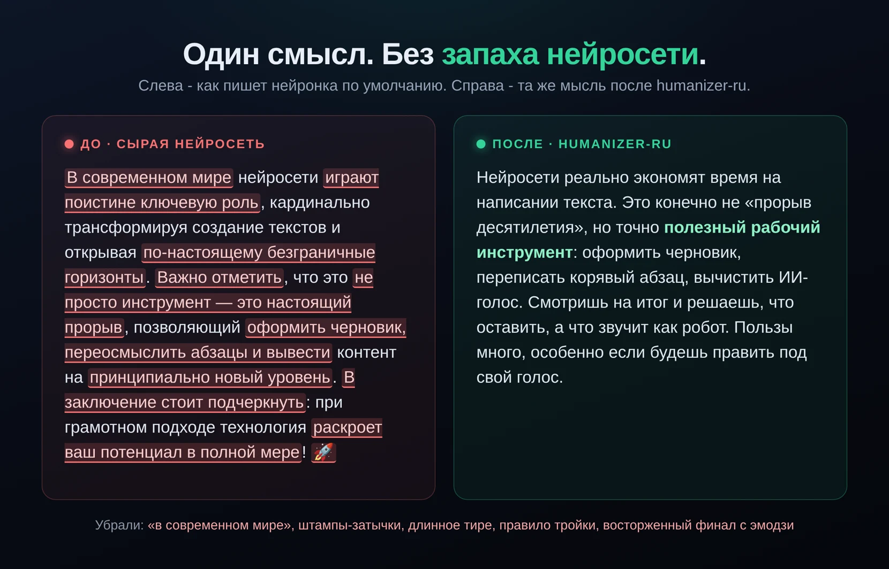

# humanizer-ru



> Делает текст нейросети живым, как будто писал человек. Заточен под русский, есть и английская версия.
> Makes AI text read like a human wrote it. Built for Russian, works for English too.

**Было:** «В современном мире важно отметить, что наш сервис играет ключевую роль в работе команды: он не просто ускоряет согласование, а трансформирует весь процесс — теперь договор согласуется за 2 дня вместо 5.»<br>
**Стало:** «Сервис ускоряет согласование: договор проходит за 2 дня вместо 5.»

[🇷🇺 Русский](#-русский) · [🇬🇧 English](#-english)

[](LICENSE) [](https://github.com/thevseprod/humanizer-ru/stargazers) [](https://github.com/thevseprod/humanizer-ru/releases) [](#для-тех-кто-работает-в-ai-агентах) [](https://skills.sh/thevseprod/humanizer-ru)

<a id="русский"></a>

## 🇷🇺 Русский

Почти все «хьюманайзеры» англоязычные и не ловят то, что выдаёт русскую нейросеть:
длинное тире «—», канцелярит, маркетинговые слова-пустышки. Этот ловит. И английский
набор правил тоже внутри.

Кода нет, ставить ничего не нужно: это markdown-файл с правилами, который ты
вставляешь в любую нейросеть. Плюс есть скилл, который ставится одной командой в
Claude Code, Cursor, Codex и другие агенты.

### Почему работает

Не просто меняет слова на синонимы. Он охотится за конкретными признаками машинного
текста и переписывает их: привычку к длинному тире, штампы-затычки («важно отметить»),
буллшит-лексикон, подобострастные концовки, безличный хедж без позиции, механическое
«правило тройки», стены текста и прочее. Потом проходит вторым проходом и проверяет
три вещи: что ещё пахнет ботом, не пропало ли по дороге что-то из фактов и не
превратился ли текст в обезличенный.

И знает, чего трогать нельзя. Повтор термина, длинная фраза, вводные слова автора,
его сомнения - это живая речь, а не следы нейросети. Если чистить нечего, текст
возвращается без правок.

### Пример



Слева типичный AI-текст со всеми признаками машины, справа - тот же текст после humanizer-ru: без штампов, канцелярита и длинного тире. Факты и цифры те же, новых не появилось.

Ещё примеры, уже текстом (пригодится, если картинка не грузится):

| Было (нейросеть) | Стало |
|---|---|
| Наш курс — это уникальная возможность прокачать навыки, расширить кругозор и выйти на новый уровень! 🚀 За 6 недель вы научитесь собирать дашборды в Excel. | За 6 недель курса научитесь собирать дашборды в Excel. |
| Стоит подчеркнуть, что подход имеет как преимущества, так и недостатки: он быстрый, однако на длинных текстах может давать сбои. | Подход быстрый, но на длинных текстах может сбоить. |
| Разберём по пунктам, почему падают охваты. Забегая вперёд: причина одна — алгоритм стал реже показывать посты со ссылками. | Охваты падают по одной причине: алгоритм стал реже показывать посты со ссылками. |

В «Стало» только то, что было в исходнике. Скилл не придумывает факты, цифры и личный опыт: если в тексте их нет, их не будет и после чистки.

**Чем меряем.** Читателем, а не детектором. Проценты «AI detected» у разных сервисов разные и меняются каждый месяц, а подгонка под них ломает нормальный текст. Если человек читает и не спотыкается - задача выполнена. Детекторы ИИ скилл не обманывает и не определяет, кто писал текст: он делает текст удобным для человека.

### Как начать за минуту (ничего не устанавливая)

Работает в ChatGPT, Claude, Gemini, DeepSeek - в любом чате.

1. Открой [файл правил](https://raw.githubusercontent.com/thevseprod/humanizer-ru/main/humanizer.ru.md) - он откроется просто текстом.
2. Выдели всё и скопируй.
3. Вставь первым сообщением в нейросеть.
4. Вторым сообщением кинь текст, который надо оживить.

Всё. Ни программ, ни регистрации, ни терминала.

### Для тех, кто работает в AI-агентах

**Одной командой** в Claude Code, Cursor, Codex, Windsurf и другие - через кросс-агентный установщик [skills](https://github.com/vercel-labs/skills):

```
npx skills add thevseprod/humanizer-ru -g
```

Флаг `-g` ставит скилл глобально, для всех проектов сразу. Без него он ляжет только в текущую папку. Во все агенты сразу: `npx skills add thevseprod/humanizer-ru -g --agent '*'`. Обновить потом: `npx skills update humanizer-ru`.

**Claude Code, как плагин:**

```
/plugin marketplace add thevseprod/humanizer-ru
/plugin install humanizer-ru@humanizer-ru
```

В плагине есть две команды: `/humanizer-ru:humanize` - чистит текст или файл, `/humanizer-ru:audit` - только проверяет и ничего не меняет. В подсказке хватит начать набирать `/humanize`.

**Одним файлом куда угодно** - скачай [`SKILL.md`](https://raw.githubusercontent.com/thevseprod/humanizer-ru/main/SKILL.md) и положи в папку скиллов своего агента. Внутри уже оба набора правил, соседние файлы не нужны.

Чужой текст скилл правит только по просьбе: попроси словами - «оживи этот текст», «убери запах ИИ», «очеловечь» - и приложи текст. А то, что агент пишет сам, он сразу пишет без штампов из быстрого списка.

**Калибровка под себя (по желанию):** дай 5-10 своих текстов (хватит и трёх) - модель снимет с них твою манеру и будет держаться её при каждой правке. Твои примеры остаются у тебя.

### Что внутри

| Файл | Что это |
|---|---|
| [`SKILL.md`](SKILL.md) | Скилл целиком в одном файле - можно просто скачать и положить куда угодно |
| [`humanizer.ru.md`](humanizer.ru.md) | Правила для **русского** текста |
| [`humanizer.en.md`](humanizer.en.md) | Правила для **английского** текста |
| `commands/` | Команды `/humanize` и `/audit` для плагина Claude Code |
| `build_single.py` | Пересобирает `SKILL.md` из двух файлов правил |
| `LICENSE` | MIT |

### Часто ищут

#### Как очеловечить текст из ChatGPT?
Вставь [файл правил](https://raw.githubusercontent.com/thevseprod/humanizer-ru/main/humanizer.ru.md) первым сообщением в ChatGPT, вторым - свой текст. Нейросеть уберёт штампы, канцелярит и длинное тире, а факты и цифры оставит как были.

#### Почему мой текст считают написанным нейросетью?
Чаще всего выдают длинное тире «—», подводки вроде «важно отметить», абзацы одной длины и концовки «надеюсь, было полезно». Убери их, и текст перестанет звучать машинно.

#### Как убрать канцелярит?
Верни глаголы на место отглагольных слов: «осуществить проверку» → «проверить», «данный» → «этот». Остальное правила сделают сами, список штампов у них в самом начале.

#### Чем заменить длинное тире?
Дефисом, запятой, двоеточием или перестрой фразу. Люди на клавиатуре почти не ставят «—», поэтому его и считают признаком нейросети.

#### Работает ли GPTZero и другие детекторы на русском?
Надёжно - нет: детекторы ошибаются и на английском, а на русском их проверяли куда меньше. Живой текст они иногда помечают как машинный. Этот скилл детекторы не обходит, он делает текст понятным человеку.

#### С какими нейросетями работает?
С любыми: ChatGPT, Claude, Gemini, DeepSeek, GigaChat, YandexGPT. Это просто текст правил, без программ и регистрации.

#### Это бесплатно?
Да, лицензия MIT: пользуйся, меняй, бери в работу.

### Предложить признак

Нашли признак нейросети, которого нет в правилах, или знаете, как их улучшить? Пишите в мой Telegram-чат про нейросети: [@buyonhighchat](https://t.me/buyonhighchat). Лучше сразу с примером текста, где он встречается.

### Версии

- **1.5.1** - примеры внутри правил тоже честные: в «живо» нет фактов, которых не было в «плохо». Правило 9 больше не просит занять сторону, если позиции в тексте нет: убирается пустая симметрия, а факты остаются.
- **1.5.0** - не дописывает лишнего. «Я», мнение автора и «приёмы живости» теперь только по просьбе или с образцами текста: раньше в чужой новости нейросеть могла написать «я проверил сам». Строже сверка смысла: «может снизить до 30%» не превращается в «снижает на 30%», причины не придумываются. Настоящее противопоставление («мы не продаём курсы, мы делаем сервис») больше не вычищается. В начале правил быстрый список «встретил - убери», плюс 7 новых правил: рубленые обрывки, «сам спросил - сам ответил», показная честность, грамматика перевода, швы после чистки, числа и диапазоны, обвязка чата. Проверка свежим взглядом. Скилл запускается и на русские просьбы, а свой текст агент сразу пишет без штампов. В плагине команды `/humanize` и `/audit`. Примеры «было → стало» в README и на картинках переписаны: в «стало» только факты из исходника.
- **1.4.1** - проще начать: копипаст в чат теперь первый способ, ссылки ведут на текст файла, у команды установки появился флаг `-g`. Правила не менялись.
- **1.4.0** - инструмент научился не портить хороший текст. Новый раздел «Что НЕ дефект»: повтор термина, длинное предложение, вводные слова автора и его сомнения - это живая речь, а не следы нейросети. Нет находок - текст возвращается без правок. Синоним больше не считается лечением: «важно отметить» → «стоит подчеркнуть» это тот же штамп. Добавлены жанр (в инструкции сухость это норма, для договоров правила не применяются), чистка технического мусора после копирования из чата и режим проверки без переписывания.
- **1.3.0** - правила переставлены по силе: первым идёт то, что чаще всего выдаёт нейросеть в русском тексте. Новое требование к чистке: не терять утверждения - слова «первый», «единственный», «впервые» несут факт, а не пафос, и убирать их нельзя. Второй проход теперь проверяет и это.
- **1.2.0** - скилл собран в один файл: скачал `SKILL.md` и положил куда угодно, соседние файлы больше не нужны. Новое правило: анонс вместо содержания («погнали», «разберём по пунктам»). Приём структурный, поэтому не лечится сменой тона на разговорный.
- **1.1.0** - установка одной командой в любой агент, плагин для Claude Code, баннер и пример «до/после» в README.
- **1.0.0** - первый выпуск: правила для русского и английского, скилл с автоопределением языка.

### Автор

Пишу и показываю про VSЁ о нейросетях, ИИ-агентах и вайбкодинге – для облегчения
жизни и заработка:

- 📢 Telegram: [@buyonhigh](https://t.me/buyonhigh)
- 💬 Чат: [@buyonhighchat](https://t.me/buyonhighchat)
- ▶️ YouTube: [@thevseproduction](https://www.youtube.com/@thevseproduction)

---

<a id="english"></a>

## 🇬🇧 English

Most "humanize AI" tools are English-only and miss the tells that give away a
Russian-language LLM (the long em dash «—», officialese, marketing buzzwords). This
one catches them, and ships an English rule set too.

No code, nothing to install: it's a markdown instruction file you paste into any LLM.
There's also a skill that installs into Claude Code, Cursor, Codex and other agents
with one command.

### Why it works

It doesn't just swap synonyms. It hunts the specific patterns that mark machine
writing and rewrites them: the em-dash habit, stock filler ("it's worth noting"),
buzzword soup, servile closers, opinion-free hedging, the mechanical rule of three,
walls of text, and more. Then it runs a second pass that checks three things: what
still smells like an AI, whether any fact went missing along the way, and whether
the text lost the author's voice.

It also knows what to leave alone. A repeated term, a long sentence, the author's
asides and doubts are human writing, not machine tells. If there is nothing to
clean, the text comes back untouched.

### Example

**Before:** In today's fast-paced world, AI is a game-changer that unlocks unprecedented potential — it doesn't just automate tasks, it transforms everything: our support team now answers tickets in 2 hours instead of 6.

**After:** AI takes over part of the routine: our support team now answers tickets in 2 hours instead of 6.

What got cut: "in today's fast-paced world", "game-changer", "unlocks unprecedented potential", the "it doesn't just X, it Y" cadence, the em dash. What stayed: the fact and the number. Nothing new was added - the skill never invents facts, numbers or personal experience.

**What we measure by.** The reader, not a detector. "AI detected" percentages differ from service to service and change every month, and tuning a text to them breaks it. If a person reads it without stumbling, the job is done. The skill does not fool AI detectors and does not tell who wrote a text: it makes the text easy for a person to read.

### Start in a minute (nothing to install)

Works in ChatGPT, Claude, Gemini, DeepSeek - any chat.

1. Open the [rules file](https://raw.githubusercontent.com/thevseprod/humanizer-ru/main/humanizer.en.md) - it opens as plain text.
2. Select all and copy.
3. Paste it as your first message to the model.
4. Send the text you want humanized as the second message.

That's it. No software, no signup, no terminal.

### If you work inside AI agents

**One command** for Claude Code, Cursor, Codex, Windsurf and others - via the cross-agent [skills](https://github.com/vercel-labs/skills) installer:

```
npx skills add thevseprod/humanizer-ru -g
```

`-g` installs the skill globally, for every project. Without it the skill lands in the current folder only. Into every agent at once: `npx skills add thevseprod/humanizer-ru -g --agent '*'`. Update later: `npx skills update humanizer-ru`.

**Claude Code, as a plugin:**

```
/plugin marketplace add thevseprod/humanizer-ru
/plugin install humanizer-ru@humanizer-ru
```

The plugin ships two commands: `/humanizer-ru:humanize` cleans a text or a file, `/humanizer-ru:audit` only checks it and changes nothing. Typing `/humanize` is enough for autocomplete.

**As a single file anywhere** - download [`SKILL.md`](https://raw.githubusercontent.com/thevseprod/humanizer-ru/main/SKILL.md) and drop it into your agent's skills folder. Both rule sets are already inside; no neighbouring files needed.

The skill edits someone else's text only when asked: say "humanize this", "strip the AI smell" and attach the text. Whatever the agent writes itself, it writes without the quick-list stock phrases from the start.

**Optional voice calibration:** give the model 5-10 samples of your own writing (three will do) - it picks up your manner and holds to it on every edit. Your samples stay with you.

### What's inside

| File | What it is |
|---|---|
| [`SKILL.md`](SKILL.md) | The whole skill in one file - download it and drop it anywhere |
| [`humanizer.ru.md`](humanizer.ru.md) | Rules for **Russian** text |
| [`humanizer.en.md`](humanizer.en.md) | Rules for **English** text |
| `commands/` | `/humanize` and `/audit` commands for the Claude Code plugin |
| `build_single.py` | Rebuilds `SKILL.md` from the two rule files |
| `LICENSE` | MIT |

### FAQ

#### How do I make ChatGPT text sound human?
Paste [the rule file](https://raw.githubusercontent.com/thevseprod/humanizer-ru/main/humanizer.en.md) as the first message, then your text. The model strips stock phrases, filler and the em dash, and keeps facts and numbers as they were.

#### Why does my text get flagged as AI?
Usually the em dash "—", lead-ins like "it's worth noting", paragraphs of the same length and closers like "I hope this helps". Cut them and the text stops sounding machine-made.

#### Will it get my text past AI detectors?
That's not the goal. The skill doesn't try to fool detectors and doesn't tell who wrote a text; it makes the text easy for a person to read.

#### Which models does it work with?
Any: ChatGPT, Claude, Gemini, DeepSeek and others. It's plain text rules, no software or sign-up.

#### Is it free?
Yes, MIT license: use it, change it, ship it.

### Suggest a tell

Found an AI tell the rules miss, or have an idea to improve them? Drop it in my Telegram chat about AI: [@buyonhighchat](https://t.me/buyonhighchat). Best with a sample text where it shows up.

### Versions

- **1.5.1** - the examples inside the rules are honest too: the "alive" side holds no facts the "bad" side didn't have. Rule 9 no longer asks to take a side when the text has no stance: the empty balancing goes, the facts stay.
- **1.5.0** - stops adding things. "I", the author's opinion and the liveliness moves now come only on request or with writing samples: before, a model could drop "I tried it myself" into someone else's news. Stricter meaning check: "may cut costs by up to 30%" no longer turns into "cuts costs by 30%", and no invented causes. A real contrast ("we don't sell courses, we build a product") is no longer scrubbed. A "spot it, fix it" quick list opens the rules, plus 7 new rules: chopped fragments, asking and answering yourself, performed honesty, grammar tells, seams after cleaning, numbers and ranges, chat wrapping. A fresh-eyes review. The skill fires on Russian requests too, and the agent keeps its own writing free of stock phrases. The plugin gets `/humanize` and `/audit` commands. The before/after examples in the README and images now keep only the facts of the original.
- **1.4.1** - easier to start: copy-paste into a chat is now the first option, links point at the raw text, the install command got the `-g` flag. Rules unchanged.
- **1.4.0** - the tool learned not to ruin good text. New section "What is NOT a defect": a repeated term, a long sentence, the author's asides and doubts are human writing, not machine tells. Nothing found - the text comes back untouched. A synonym no longer counts as a fix: "it's worth noting" → "it bears emphasis" is the same stock phrase. Added genre awareness (dryness is the norm in a spec; don't apply the rules to contracts), clean-up of technical debris left by copy-paste from a chat, and a check-only mode.
- **1.3.0** - rules reordered by strength: the most common tells come first. New constraint: do not lose claims - words like "first", "only", "record" carry a fact, not hype, and must survive the cleanup. The second pass now checks for it.
- **1.2.0** - the skill ships as a single file: download `SKILL.md`, drop it anywhere, no neighbouring files needed. New rule: announcing instead of saying ("let's dive in", "here's the thing"). It is structural, so switching to a casual tone does not remove it.
- **1.1.0** - one-command install into any agent, Claude Code plugin, banner and a before/after example in the README.
- **1.0.0** - first release: Russian and English rule sets, skill with language auto-detection.

### Author

I write and show everything about neural nets, AI agents and vibe-coding, to make life
and earning easier:

- 📢 Telegram: [@buyonhigh](https://t.me/buyonhigh)
- 💬 Chat: [@buyonhighchat](https://t.me/buyonhighchat)
- ▶️ YouTube: [@thevseproduction](https://www.youtube.com/@thevseproduction)

---

## License

MIT, see [`LICENSE`](LICENSE). Use it, fork it, ship it.
